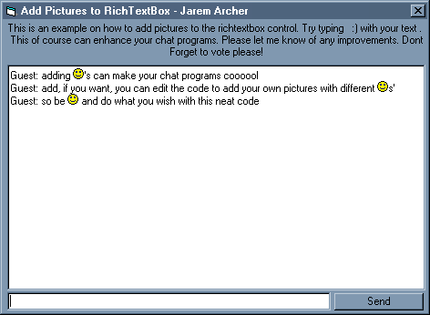



## Add Pictures to RichTextBox  \(In Chat Procedure\)

### Description

This can add pictures to a RichTextBox by replacing ":)" with smiley faces. Hope you like it. Please Vote and tell me of any improvements.
 
### More Info
 

             |
---                |---
**Submitted On**   |2001-01-05 14:12:00
**By**             |[Jarem Archer](https://github.com/Planet-Source-Code/PSCIndex/blob/master/ByAuthor/jarem-archer.md)
**Level**          |Intermediate
**User Rating**    |4.6 (69 globes from 15 users)
**Compatibility**  |VB 5\.0, VB 6\.0
**Category**       |[Coding Standards](https://github.com/Planet-Source-Code/PSCIndex/blob/master/ByCategory/coding-standards__1-43.md)
**World**          |[Visual Basic](https://github.com/Planet-Source-Code/PSCIndex/blob/master/ByWorld/visual-basic.md)
**Archive File**   |[CODE\_UPLOAD13407152001\.zip](https://github.com/Planet-Source-Code/jarem-archer-add-pictures-to-richtextbox-in-chat-procedure__1-14153/archive/master.zip)

